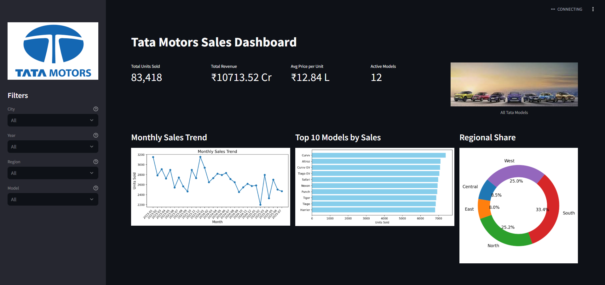

# Tata Motors Sales Dashboard 🚗📊

An interactive dashboard built using **Python**, **Pandas**, **Matplotlib**, and **Streamlit** to visualize Tata Motors car sales data.

## Features

- Filter by City, Year, Region, and Model
- View Monthly Sales Trend
- Visualize Top-Selling Models
- Region-wise Performance Pie Chart
- Display car images dynamically
- KPIs: Units Sold, Revenue, Average Price, Active Models

## Demo



## Run Locally

```bash
git clone https://github.com/YOUR-USERNAME/Tata_motors_sales_dashboard.git
cd Tata_motors_sales_dashboard
pip install -r requirements.txt
streamlit run app.py
